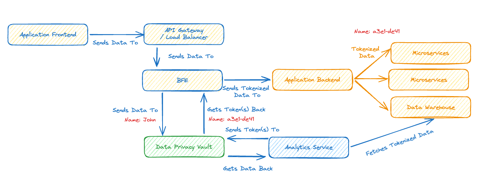

# Data Privacy Vault

a service that can function as a Data Privacy Vault, that’s the green bit in the high-level diagram below that conceptually shows where it would fit in some sort of production system.



Our service will provide a HTTP based API that can be used to send sensitive data to be stored in the vault, receiving back a token that can later be used to retrieve the sensitive data by an authorised user/service.

To understand why the Data Privacy Vault is preferable to just encrypting the data check out Wikipedia’s article on Tokenization.

## Step 1
In this step my goal is to create a simple tokenisation service that can create tokens and return their value, for the moment storing the data in memory is fine.

Once this is done I will have two endpoints:

Endpoint: `/tokenize`

Method: `POST`

Request payload:

```json
{
	"id": req-12345”,
	"data": {
		"field1": "value1",
		"field2": "value2",
		"fieldn": "valuen"
	}
}
```
Success response: HTTP Code 201

Payload:
```json
{
	"id": req-12345”,
	"data": {
		"field1": "t6yh4f6",
		"field2": "gh67ned",
		"fieldn": "bnj7ytb"
	}
}
```

Endpoint: `/detokenize`

Method: `POST`

Request payload:
```json
{
	"id": req-33445”,
	"data": {
		"field1": "t6yh4f6",
		"field2": "gh67ned",
		"field3": "invalid token"
	}
}
```
Response:
```json
	"id": req-33445”,
	"data": {
		"field1": {
			"found": true,
			"value": "value1"
		},
		"field2": {
			"found": true,
			"value": "value2"
		},
		"fieldn": {
			"found": false,
			"value": ""
		}
	}
```
